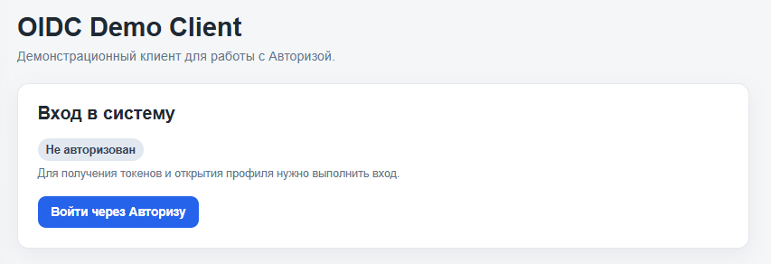
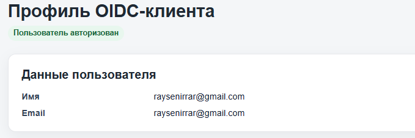
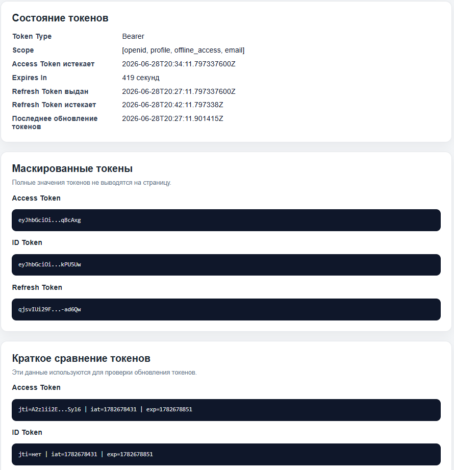
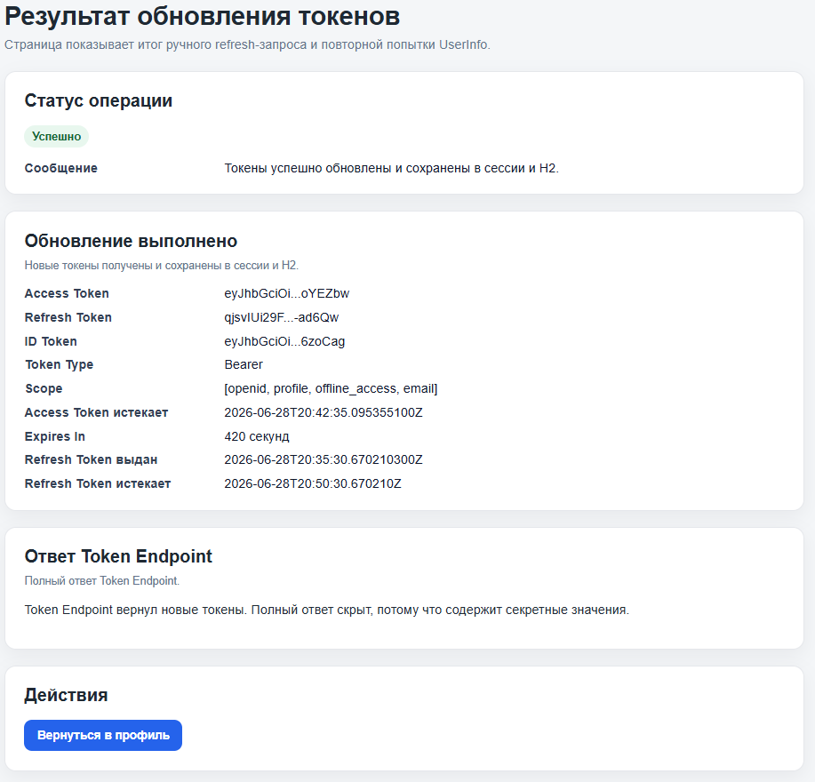

# Authoriza Spring Boot OIDC Client

**Демонстрационный проект интеграции Авторизы для Spring Boot**

Проект представляет собой web-приложение на **Java Spring Boot**, демонстрирующее интеграцию с сервисом **Авториза** по протоколу **OpenID Connect**.

Приложение реализует полный цикл аутентификации пользователя, получение токенов, отображение JWT-содержимого, ручное и автоматическое обновление токенов, сохранение сессии и восстановление авторизации после перезапуска.

## Назначение проекта

Данный проект является примером интеграции Авторизы для стека **Java + Spring Boot**.

Он демонстрирует:

* Реализацию **OpenID Connect Authorization Code Flow with PKCE**.
* Получение и отображение токенов: **Access Token**, **ID Token**, **Refresh Token**.
* Декодирование JWT-токенов и отображение их содержимого.
* Получение данных пользователя из ID Token.
* Сохранение токенов в локальное хранилище.
* Восстановление сессии после перезапуска приложения.
* Ручное обновление токенов через Refresh Token.
* Автоматическое обновление Access Token до истечения срока действия.
* Обработку ситуации, когда Refresh Token больше не принимается провайдером.
* Выход из приложения с очисткой сохранённой сессии.

## Стек технологий

| Компонент               | Инструмент                    |
| ----------------------- | ----------------------------- |
| **Язык**                | Java 21                       |
| **Фреймворк**           | Spring Boot                   |
| **Безопасность**        | Spring Security               |
| **OIDC клиент**         | Spring Security OAuth2 Client |
| **Шаблонизатор**        | Thymeleaf                     |
| **Локальное хранилище** | H2 Database                   |
| **Сборка**              | Maven                         |
| **Запуск**              | Maven Wrapper                 |

Основная библиотека для работы с OpenID Connect:

```xml
spring-boot-starter-oauth2-client
```

## Требования к окружению

Перед запуском убедитесь, что установлены следующие компоненты:

* **JDK 21** или выше.
* Доступ к продовому стенду Авторизы: `https://oidc.authoriza.ru`.
* Зарегистрированное приложение в Авторизе.
* Настроенный Redirect URI.
* Client ID и Client Secret, полученные в Авторизе. В репозитории они не хранятся.
* Терминал PowerShell, CMD или bash.

Проверить версию Java можно командой:

```bash
java -version
```

Проверить наличие компилятора Java:

```bash
javac -version
```

## Установка зависимостей

Проект использует Maven Wrapper, поэтому отдельно устанавливать Maven не требуется.

Для установки зависимостей и сборки проекта на Windows:

```powershell
.\mvnw.cmd clean install
```

Для Linux или macOS:

```bash
./mvnw clean install
```

## Настройка приложения в Авторизе

Для работы приложения необходимо зарегистрировать OIDC-приложение в Авторизе и получить данные клиента.

### Основные параметры

| Параметр                         | Значение                                         |
| -------------------------------- | ------------------------------------------------ |
| **Flow**                         | Authorization Code Flow                          |
| **PKCE**                         | Включён                                          |
| **Client authentication method** | client_secret_basic                              |
| **Redirect URI**                 | http://localhost:8080/login/oauth2/code/autoriza |
| **Состояние приложения**         | Включено                                         |

### Scopes

В приложении используются следующие scopes:

```text
openid
profile
email
offline_access
```

Scope `offline_access` нужен для получения Refresh Token.

## Discovery

Приложение использует Discovery через `issuer-uri`.

OIDC endpoint-ы не прописываются вручную в коде. Spring Security получает их автоматически через Discovery.

Issuer URI:

```text
https://oidc.authoriza.ru/
```

Пример настройки в `application.yml`:

```yaml
spring:
  security:
    oauth2:
      client:
        registration:
          autoriza:
            client-id: "${AUTORIZA_CLIENT_ID}"
            client-secret: "${AUTORIZA_CLIENT_SECRET}"
            client-authentication-method: client_secret_basic
            authorization-grant-type: authorization_code
            redirect-uri: "{baseUrl}/login/oauth2/code/{registrationId}"
            scope:
              - openid
              - profile
              - email
              - offline_access
        provider:
          autoriza:
            issuer-uri: https://oidc.authoriza.ru/
```

## Настройка Client ID и Client Secret

Client ID и Client Secret не хранятся в репозитории.

Для безопасности они передаются через переменные окружения:

```text
AUTORIZA_CLIENT_ID
AUTORIZA_CLIENT_SECRET
```

Для Windows PowerShell:

```powershell
$env:AUTORIZA_CLIENT_ID="your_client_id"
$env:AUTORIZA_CLIENT_SECRET="your_client_secret"
```

Для Linux или macOS:

```bash
export AUTORIZA_CLIENT_ID="your_client_id"
export AUTORIZA_CLIENT_SECRET="your_client_secret"
```

После этого можно запускать приложение.

## Запуск проекта

Для запуска на Windows:

```powershell
.\mvnw.cmd clean spring-boot:run
```

Для Linux или macOS:

```bash
./mvnw clean spring-boot:run
```

После запуска приложение будет доступно по адресу:

```text
http://localhost:8080/
```

## Основные страницы приложения

### Главная страница

```text
/
```

На главной странице отображается текущий статус авторизации.

Если пользователь не авторизован, отображается кнопка входа через Авторизу.

Если в локальной H2-базе есть сохранённая сессия, приложение автоматически пытается восстановить авторизацию.

### Профиль пользователя

```text
/profile
```

На странице профиля отображаются:

* данные пользователя из ID Token;
* Token Type;
* scopes;
* срок действия Access Token;
* срок действия Refresh Token, если он доступен;
* время последнего обновления токенов;
* маскированные значения Access Token, ID Token и Refresh Token;
* декодированный payload ID Token;
* декодированный payload Access Token;
* идентификаторы токенов, если соответствующие claims присутствуют в JWT

Полные значения токенов на страницу не выводятся.

Срок жизни Refresh Token приложением не рассчитывается вручную. Если провайдер не передал достоверное время истечения Refresh Token, приложение отображает значение `Неизвестно`.

### Обновление токенов

```text
POST /refresh-token
```

На странице профиля доступна кнопка ручного обновления токенов.

После обновления приложение отображает:

* статус операции;
* маскированные новые токены;
* новый срок действия Access Token;
* срок действия Refresh Token, если он доступен;
* информацию об успешной обработке ответа Token Endpoint.

### Выход из приложения

```text
POST /logout
```

При выходе приложение:

* удаляет сохранённые токены из H2;
* очищает HTTP-сессию;
* сбрасывает авторизацию пользователя;
* возвращает пользователя на главную страницу.

## Хранение сессии

Для локального хранения токенов используется **H2 Database**.

H2 Console доступна по адресу:

```text
http://localhost:8080/h2-console
```

Параметры подключения:

```text
JDBC URL: jdbc:h2:file:./data/oidc-client-db
User Name: sa
Password:
```

Основная таблица:

```sql
SELECT * FROM STORED_AUTH_DATA;
```

В таблице сохраняются:

* registration ID;
* principal name;
* Access Token;
* Refresh Token;
* ID Token;
* время выдачи Access Token;
* время истечения Access Token;
* время выдачи Refresh Token;
* время истечения Refresh Token, если оно доступно;
* время выдачи ID Token;
* время истечения ID Token;
* scopes;
* время последнего обновления токенов.

Папка `data/` добавлена в `.gitignore` и не должна попадать в репозиторий.

## Проверка основных сценариев

### 1. Вход через Авторизу

1. Открыть приложение:

```text
http://localhost:8080/
```

2. Нажать кнопку входа через Авторизу.
3. Выполнить авторизацию.
4. Убедиться, что после входа открывается профиль пользователя.

Ожидаемый результат:

* пользователь авторизован;
* данные пользователя отображаются;
* получены Access Token, ID Token и Refresh Token.

### 2. Проверка PKCE

При переходе на Authorization Endpoint в URL должны присутствовать параметры:

```text
code_challenge=...
code_challenge_method=S256
```

Это подтверждает, что используется Authorization Code Flow with PKCE.

### 3. Отображение токенов

На странице `/profile` должны отображаться:

* Access Token в маскированном виде;
* ID Token в маскированном виде;
* Refresh Token в маскированном виде;
* срок действия Access Token;
* срок действия Refresh Token, если он доступен;
* JWT payload Access Token;
* JWT payload ID Token.

### 4. Ручное обновление токенов

1. Открыть страницу `/profile`.
2. Нажать кнопку **Обновить токены**.
3. Проверить страницу результата обновления.

Ожидаемый результат:

* Token Endpoint возвращает новые токены;
* новые токены сохраняются в сессии;
* новые токены сохраняются в H2;
* срок действия Access Token обновляется.

### 5. Автоматическое обновление Access Token

Access Token обновляется автоматически до истечения срока действия при обращении пользователя к защищённым страницам.

Для проверки:

1. Выполнить вход.
2. Дождаться приближения срока истечения Access Token.
3. Обновить страницу профиля.
4. Проверить, что срок действия Access Token изменился.

### 6. Восстановление сессии после перезапуска

1. Выполнить вход.
2. Убедиться, что токены сохранены в H2.
3. Остановить приложение.
4. Запустить приложение снова.
5. Открыть:

```text
http://localhost:8080/
```

Ожидаемый результат:

* приложение находит сохранённые токены;
* выполняет восстановление сессии;
* пользователь попадает на страницу профиля без повторной ручной авторизации, если Refresh Token ещё действителен.

### 7. Недействительный Refresh Token

Приложение не рассчитывает срок жизни Refresh Token вручную. Если провайдер не возвращает срок действия Refresh Token, в интерфейсе отображается значение `Неизвестно`.

Если при попытке восстановления или обновления провайдер отклоняет Refresh Token, приложение:

* удаляет сохранённые токены;
* очищает локальную сессию;
* не выполняет восстановление;
* возвращает пользователя к состоянию до авторизации.

### 8. Выход из приложения

1. Открыть `/profile`.
2. Нажать кнопку **Выйти**.
3. Проверить H2.

Ожидаемый результат:

* пользователь выходит из приложения;
* запись в `STORED_AUTH_DATA` удаляется;
* повторное восстановление сессии невозможно.

## Структура проекта

```text
authoriza-spring-demo/
├── .mvn/                         # Maven Wrapper
├── src/
│   ├── main/
│   │   ├── java/
│   │   │   └── com/example/oidc_client/
│   │   │       ├── config/        # SecurityConfig и фильтр автообновления Access Token
│   │   │       ├── controller/    # Контроллеры главной страницы, профиля, refresh и восстановления сессии
│   │   │       ├── dto/           # DTO для токенов, профиля и результатов refresh
│   │   │       ├── service/       # Бизнес-логика OIDC, refresh, восстановления и профиля
│   │   │       ├── storage/       # Сущность, репозиторий и сервис хранения токенов
│   │   │       ├── util/          # Утилиты для JWT, scopes, маскирования и времени
│   │   │       └── OidcClientApplication.java
│   │   └── resources/
│   │       ├── templates/         # Thymeleaf-шаблоны
│   │       └── application.yml    # Настройки приложения
├── .gitattributes
├── .gitignore
├── HELP.md
├── README.md
├── mvnw
├── mvnw.cmd
└── pom.xml
```

## Скриншоты


### Экран до входа

Главная страница до авторизации.



### Экран после входа

Страница профиля после успешной авторизации.



### Отображение токенов

Блок на странице профиля с маскированными токенами, сроками действия и JWT payload.



### Результат обновления токенов

Страница результата ручного обновления токенов.



## Возможные проблемы и решения

| Проблема                                      | Возможная причина                                       | Решение                                                                         |
| --------------------------------------------- | ------------------------------------------------------- | ------------------------------------------------------------------------------- |
| `No compiler is provided`                     | Запуск выполняется на JRE, а не на JDK                  | Установить JDK 21+ и проверить `JAVA_HOME`                                      |
| `client_secret` не найден                     | Не задана переменная окружения `AUTORIZA_CLIENT_SECRET` | Перед запуском задать переменную окружения                                      |
| Не приходит Refresh Token                     | Не указан scope `offline_access`                        | Проверить scopes в `application.yml`                                            |
| Нет `code_challenge` в URL авторизации        | Не включён PKCE                                         | Проверить `OAuth2AuthorizationRequestCustomizers.withPkce()` в `SecurityConfig` |
| После перезапуска сессия не восстанавливается | Refresh Token истёк или данные были очищены             | Выполнить вход заново                                                           |
| H2 Console не открывается                     | Неверный JDBC URL или настройки Security                | Использовать `jdbc:h2:file:./data/oidc-client-db`                               |
| Бесконечные редиректы                         | Старая или битая сохранённая сессия                     | Открыть `/?skipRestore=true` или очистить таблицу `STORED_AUTH_DATA`            |

## Полезные ссылки

* [Spring Security OAuth2 Client](https://docs.spring.io/spring-security/reference/servlet/oauth2/client/index.html)
* [Spring Boot Documentation](https://docs.spring.io/spring-boot/index.html)
* [H2 Database](https://www.h2database.com/html/main.html)
* [OpenID Connect Core](https://openid.net/specs/openid-connect-core-1_0.html)

## Безопасность

В репозиторий не должны попадать:

* Client ID;
* Client Secret;
* `.env`;
* локальная H2-база;
* токены;
* дампы Token Endpoint response;
* логи запуска;
* папка `target/`.

Для этого используется `.gitignore`.

Client ID и Client Secret передаются через переменные окружения:

```text
AUTORIZA_CLIENT_ID
AUTORIZA_CLIENT_SECRET
```

## Статус реализации

Реализовано:

* OIDC Discovery через `issuer-uri`;
* Authorization Code Flow with PKCE;
* получение Access Token, ID Token и Refresh Token;
* отображение параметров токенов;
* декодирование JWT payload;
* получение данных пользователя из ID Token;
* ручное обновление токенов;
* автоматическое обновление Access Token;
* сохранение токенов в H2;
* восстановление сессии после перезапуска;
* обработка отклонения Refresh Token провайдером;
* logout с очисткой сохранённых данных;
